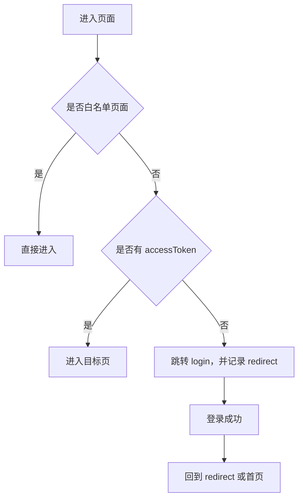

# 乘客端/司机端 uni-app 重构设计清单

> 版本：V1.0  
> 日期：2026-07-31  
> 范围：`apps/passenger-uni-app/uni-app`、`apps/driver-uni-app/uni-app`  
> 目标：把现有“工单展示型页面”重构为“可真实对接后端的移动端业务应用”。

## 1. 当前结论

现有乘客端和司机端已经具备 uni-app 基础目录：

- `api/`：已有登录、工单 01、工单 10、工单 11 接口封装。
- `pages/`：已有首页、登录、订单、AI、轨迹、性能等页面。
- `store/`：已有端侧状态目录。
- `utils/request.js`：已有统一请求入口。

但当前前端仍存在 4 个核心问题：

- 页面按工单/占位思路组织，业务链路不够自然。
- API 文件按 `workorder01/workorder10/workorder11` 命名，不适合长期维护。
- `pages.json` 中文标题存在乱码，需要统一修复。
- 部分页面仍是静态验收页，没有和后端接口形成闭环。

## 2. 重构原则

- 不合并乘客端和司机端代码，不恢复 `packages/shared`。
- 保留 uni-app 技术栈，保留两个端独立运行。
- API 层按业务域命名，不再按工单命名。
- 页面以真实用户流程为主，不以工单编号为主。
- 所有后端请求只能通过 `api/*` 和 `utils/request.js` 发起，页面禁止直接 `uni.request`。
- 对后端不存在的接口，不做假联调，只保留“待接入”空状态和接口清单。
- 登录、token、refresh、错误处理、trace id、loading、空状态必须统一。

## 3. 目标目录结构

### 3.1 乘客端

```text
apps/passenger-uni-app/uni-app/src/
  api/
    auth.js
    trip.js
    order.js
    review.js
    ai.js
    profile.js
    ticket.js
    coupon.js
  pages/
    login/
    home/
    trips/
    tripDetail/
    publishDemand/
    orders/
    orderDetail/
    tracking/
    aiAssistant/
    floodReport/
    coupons/
    ticket/
    profile/
  store/
    auth.js
    user.js
    order.js
    location.js
  utils/
    request.js
    auth.js
    route.js
    format.js
    validator.js
```

### 3.2 司机端

```text
apps/driver-uni-app/uni-app/src/
  api/
    auth.js
    driver.js
    vehicle.js
    trip.js
    order.js
    location.js
    ai.js
    income.js
  pages/
    login/
    home/
    certification/
    vehicle/
    publishTrip/
    myTrips/
    pendingOrders/
    orderDetail/
    locationReport/
    trackReplay/
    aiAlerts/
    incomeLedger/
    profile/
  store/
    auth.js
    driver.js
    dispatch.js
    location.js
  utils/
    request.js
    auth.js
    gps.js
    format.js
    validator.js
```

## 4. 统一请求设计

`utils/request.js` 需要统一承担以下能力：

| 能力 | 要求 |
|---|---|
| baseURL | 从环境配置读取，支持本地、测试、生产 |
| token | 自动写入 `Authorization: Bearer <token>` |
| refresh | 401 时自动调用 `/carpool/auth/refresh` |
| 退出登录 | refresh 失败后清理本地 token 并跳转登录页 |
| trace | 每次请求生成或透传 `x-trace-id`、`x-request-id` |
| 错误提示 | 默认 toast，接口可传 `silent: true` 静默 |
| loading | 支持页面级 loading 和按钮级 loading |
| 防重复提交 | POST/PUT 可按 URL + body 做短时间锁 |
| 业务响应 | 统一兼容 `{code,data,msg}` 或后端直接 data |
| 超时 | 默认 10s，AI/轨迹类接口可单独放宽 |

## 5. 乘客端页面与接口清单

| 页面 | 页面职责 | 对接 API | 状态 |
|---|---|---|---|
| `login/login` | 短信登录、token 保存 | `POST /carpool/auth/sms/send`、`POST /carpool/auth/login` | 已有接口，需重做 UI 和状态 |
| `home/home` | 出行入口、附近行程、AI 提醒 | `GET /carpool/trips`、`POST /api/v1/ai/rain-route` | 可接入 |
| `trips/index` | 搜索顺风车行程 | `GET /carpool/trips` | 可接入 |
| `tripDetail/index` | 行程详情、下单入口 | `GET /carpool/trips/{id}`、`POST /carpool/orders` | 可接入 |
| `publishDemand/index` | 乘客发布出行需求 | 待确认后端是否已有乘客需求接口 | 待后端确认 |
| `orders/index` | 我的订单列表 | `GET /carpool/orders` 或 `GET /api/v1/passenger/orders` | 需统一口径 |
| `orderDetail/index` | 订单详情、取消、评价 | `GET /carpool/orders/{id}`、`POST /carpool/orders/{id}/cancel`、`POST /carpool/reviews` | 可接入 |
| `tracking/index` | 订单轨迹、司机位置 | `GET /api/v1/passenger/orders/{id}/track` | 可接入 |
| `aiAssistant/index` | AI 出行助手 | `POST /api/v1/ai/chat`、`POST /api/v1/ai/chat-with-route` | 可接入 |
| `floodReport/index` | 水情/积水上报 | `POST /api/v1/ai/flood-report` | 可接入 |
| `coupons/index` | 优惠券列表、使用说明 | 待移动端营销接口 | 待后端补齐 |
| `ticket/index` | 班车票列表、购票入口 | 待移动端班车接口 | 待后端补齐 |
| `profile/index` | 我的资料、实名认证状态 | 待乘客资料/实名接口 | 待后端补齐 |

## 6. 司机端页面与接口清单

| 页面 | 页面职责 | 对接 API | 状态 |
|---|---|---|---|
| `login/login` | 短信登录、token 保存 | `POST /carpool/auth/sms/send`、`POST /carpool/auth/login` | 已有接口，需重做 UI 和状态 |
| `home/home` | 工作台、认证状态、待接单摘要 | 多接口聚合：司机资料、车辆、待接单 | 需页面聚合 |
| `certification/index` | 司机实名、驾驶证、行驶证认证 | `POST /carpool/drivers/certification` | 可接入 |
| `vehicle/index` | 车辆信息维护 | `POST /carpool/drivers/vehicles` | 可接入 |
| `publishTrip/index` | 发布顺风车行程 | `POST /carpool/trips` | 可接入 |
| `myTrips/index` | 我的行程、上下架 | `GET /carpool/trips/mine`、`PUT /carpool/trips/{id}/status` | 可接入 |
| `pendingOrders/index` | 待接订单 | `GET /carpool/orders/pending`、`GET /api/v1/driver/orders/available` | 需统一口径 |
| `orderDetail/index` | 接单、拒单、订单详情 | `POST /carpool/orders/{id}/accept`、`POST /carpool/orders/{id}/reject`、`POST /api/v1/driver/orders/{id}/accept` | 需统一口径 |
| `locationReport/index` | 司机位置上报 | `POST /api/v1/driver/location/report` | 可接入 |
| `trackReplay/index` | 轨迹回放 | `GET /api/v1/driver/track/replay` | 可接入 |
| `aiAlerts/index` | AI 预警 | `GET /api/v1/driver/ai-alerts` | 可接入 |
| `incomeLedger/index` | 收入明细 | 待司机端收入接口 | 待后端补齐 |
| `profile/index` | 司机资料、退出登录 | 司机资料接口待确认 | 待后端确认 |

## 7. API 文件重命名映射

### 7.1 乘客端

| 当前文件 | 新文件 | 处理 |
|---|---|---|
| `api/auth.js` | `api/auth.js` | 保留并规范函数名 |
| `api/workorder01.js` | `api/trip.js`、`api/order.js`、`api/review.js` | 拆分 |
| `api/workorder10.js` | `api/ai.js` | 重命名 |
| `api/workorder11.js` | `api/order.js`、`api/location.js` | 合并到业务域 |
| `api/placeholders.js` | 删除或移入 `mock/` | 不允许生产页面依赖 placeholder |

### 7.2 司机端

| 当前文件 | 新文件 | 处理 |
|---|---|---|
| `api/auth.js` | `api/auth.js` | 保留并规范函数名 |
| `api/workorder01.js` | `api/trip.js`、`api/order.js`、`api/driver.js`、`api/vehicle.js` | 拆分 |
| `api/workorder10.js` | `api/ai.js` | 重命名 |
| `api/workorder11.js` | `api/order.js`、`api/location.js` | 合并到业务域 |
| `api/placeholders.js` | 删除或移入 `mock/` | 不允许生产页面依赖 placeholder |

## 8. 状态管理设计

### 8.1 乘客端 store

| store | 字段 | 用途 |
|---|---|---|
| `auth.js` | `accessToken`、`refreshToken`、`expiresAt`、`role` | 登录态 |
| `user.js` | `profile`、`realNameStatus` | 我的资料 |
| `order.js` | `currentOrderId`、`orderCache`、`trackCache` | 订单与轨迹 |
| `location.js` | `lat`、`lng`、`city`、`permissionStatus` | 定位 |

### 8.2 司机端 store

| store | 字段 | 用途 |
|---|---|---|
| `auth.js` | `accessToken`、`refreshToken`、`expiresAt`、`role` | 登录态 |
| `driver.js` | `certificationStatus`、`vehicleStatus`、`driverProfile` | 司机资料 |
| `dispatch.js` | `availableOrders`、`activeOrderId` | 接单 |
| `location.js` | `lat`、`lng`、`reporting`、`lastReportAt` | 位置上报 |

## 9. 路由与登录守卫

`pages.json` 需要完成：

- 修复所有中文乱码。
- 删除不用的 `pages/index/index.vue` 或明确为兼容跳转页。
- tabBar 文案按真实业务改名。
- 页面标题统一中文。

登录守卫策略：



白名单页面：

- `login/login`
- 可选：协议、隐私政策、帮助页

## 10. UI 改造方向

### 10.1 乘客端

乘客端主视觉应突出“出行决策”和“安全感”：

- 首页第一屏：目的地、出发时间、附近行程、AI 雨天提醒。
- 订单页：状态清晰，突出司机、车辆、时间、路线。
- 轨迹页：地图优先，列表信息作为下方抽屉。
- AI 页：对话与路线卡结合，不做普通聊天页面。
- 水情上报：位置、图片、风险等级、备注，一屏完成。

### 10.2 司机端

司机端主视觉应突出“工作台”和“效率”：

- 首页第一屏：今日状态、认证/车辆状态、待接单数量、位置上报状态。
- 待接单页：距离、价格、乘客信息、路线、接单按钮必须高优先级。
- 位置页：一键上报、自动上报开关、最近上报时间。
- AI 预警页：按风险等级排序，和当前行程/位置关联。
- 收入页：没有接口时保留待接入状态，不做假数据。

## 11. 错误与空状态规范

| 场景 | 前端行为 |
|---|---|
| 未登录 | 跳转登录页 |
| token 过期 | 自动 refresh，失败后退出 |
| 403 | 显示无权限，并回到首页 |
| 404 | 显示资源不存在 |
| 5xx | 显示服务异常，提供重试按钮 |
| 网络断开 | 显示网络异常，允许重试 |
| 空列表 | 展示业务化空状态，不展示 mock 数据 |
| 待后端接口 | 明确显示“接口待接入”，不假装成功 |

## 12. 后端接口待统一问题

当前前端重构前需要确认以下接口口径：

| 问题 | 当前现象 | 建议 |
|---|---|---|
| 订单接口双口径 | 同时存在 `/carpool/orders` 与 `/api/v1/passenger/orders` | 明确移动端订单中心以 `/api/v1` 为准，顺风车基础订单以 `/carpool` 为准 |
| 司机接单双口径 | 同时存在 `/carpool/orders/{id}/accept` 与 `/api/v1/driver/orders/{id}/accept` | WO-11 派单中心用 `/api/v1/driver/*`，顺风车基础接单用 `/carpool/*` |
| 乘客实名认证 | 当前乘客端缺资料/实名接口 | 后端需补 passenger profile/certification |
| 班车移动端 | ticket 页面暂无接口 | 后端需补班车票查询/购票/退票 |
| 优惠券移动端 | coupons 页面暂无接口 | 后端需补用户券列表/可用券 |
| 司机收入 | incomeLedger 页面暂无接口 | 后端需补司机收入明细/汇总 |

## 13. 推荐实施顺序

### 阶段 1：基础框架清理

- 修复 `pages.json` 中文乱码。
- 明确乘客端、司机端 tabBar。
- 清理或改造 `pages/index/index.vue`。
- 建立业务域 API 文件。
- 重写/增强 `utils/request.js`。

### 阶段 2：乘客端核心闭环

- 登录。
- 首页。
- 行程列表。
- 行程详情。
- 下单。
- 订单列表。
- 订单详情。
- 轨迹查看。
- AI 助手和水情上报。

### 阶段 3：司机端核心闭环

- 登录。
- 司机认证。
- 车辆维护。
- 发布行程。
- 我的行程。
- 待接单。
- 接单/拒单。
- 位置上报。
- 轨迹回放。
- AI 预警。

### 阶段 4：待补接口页面治理

- 乘客端：班车票、优惠券、实名认证。
- 司机端：收入账本、司机资料。
- 所有待后端页面必须显示真实待接入状态。

### 阶段 5：联调验收

- H5 构建通过。
- 登录 refresh 流程通过。
- 乘客端核心链路通过。
- 司机端核心链路通过。
- 401/403/500/网络异常都有可见处理。
- 页面不再依赖 placeholder 数据。

## 14. 验收清单

| 类别 | 验收项 |
|---|---|
| 构建 | `npm run build:h5 --workspace passenger-uni-app` 通过 |
| 构建 | `npm run build:h5 --workspace driver-uni-app` 通过 |
| 路由 | 所有 `pages.json` 中文标题正常 |
| 登录 | 短信登录、token 保存、退出登录正常 |
| token | 401 自动 refresh，失败回登录 |
| 乘客核心 | 行程搜索、详情、下单、订单、轨迹可用 |
| 司机核心 | 认证、车辆、发布行程、待接单、接单、位置上报可用 |
| AI | 乘客 AI、雨天路线、水情上报、司机 AI 预警可用 |
| 空状态 | 没有 mock 伪成功 |
| 异常 | 后端错误和网络错误有统一提示 |

## 15. 不建议做的事

- 不建议继续保留 `workorderXX.js` 作为正式 API 文件。
- 不建议页面直接请求后端。
- 不建议把乘客端和司机端合并成一个 app。
- 不建议恢复 `packages/shared`。
- 不建议在没有后端接口的页面继续写假数据。
- 不建议把管理端 GVA 页面风格套到移动端。

## 16. 最终目标

重构完成后，两个 uni-app 应该达到：

- 目录干净。
- 页面真实。
- 接口清晰。
- 登录态稳定。
- 可以和 Kratos gateway 后端直接联调。
- 静态占位页全部被真实业务页或明确待接入状态替代。

